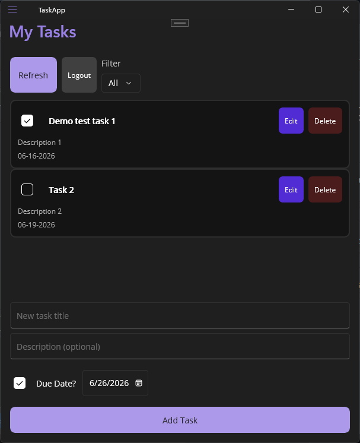

# DotNetLearning — Full-Stack Task Manager

[](https://dotnet.microsoft.com/)
[](https://github.com/AndrewRodman/DotNetLearning/actions/workflows/ci.yml)
[](https://taskapi-andrew.azurewebsites.net)

Portfolio project: ASP.NET Core Web API, .NET MAUI client, SQL Server, JWT auth, and Azure deployment.

Built while transitioning from VB.NET / ASP.NET Web Forms and Xamarin/MAUI to modern .NET.

## Live demo



- **API:** https://taskapi-andrew.azurewebsites.net
- **Try it:** `GET /health` returns `200 OK` (no auth). `GET /api/tasks` returns `401 Unauthorized` without a token (expected)
- **Database:** Azure SQL (free tier)

## Tech stack

| Layer | Technology |
|-------|------------|
| API | ASP.NET Core Web API (.NET 10) |
| Client | .NET MAUI (`TaskApp`) |
| Data | EF Core, SQL Server (LocalDB dev / Azure SQL prod) |
| Auth | JWT Bearer |
| Cloud | Azure App Service (Free F1) + Azure SQL |
| CI | GitHub Actions (`dotnet test` on push) |
| Tests | xUnit, Moq, `WebApplicationFactory` (API), mocked `HttpClient` (MAUI client) |

## Features

- User registration and login (password hashing)
- Health check endpoint (`GET /health`, includes database check)
- JWT-protected task endpoints
- Per-user task isolation (users only see and modify their own tasks)
- Full CRUD on tasks with optional due dates
- Optional filter: `GET /api/tasks?isComplete=true|false`
- MAUI app — login, list tasks, filter (All / Open / Complete), add tasks, optional due date, edit tasks, mark complete, delete tasks (with confirm), pull-to-refresh on mobile + Refresh button (Windows)
- EF Core migrations (SQLite → SQL Server)
- **35 tests** — 23 API (18 unit + 5 integration) + 12 MAUI client (`TaskApiService` with mocked HTTP)

## Getting started

### Prerequisites

- [.NET SDK 10](https://dotnet.microsoft.com/download) or later
- [Visual Studio 2022+](https://visualstudio.microsoft.com/) (recommended)
- SQL Server LocalDB (ships with Visual Studio) for local API development

### Clone and test

```powershell
git clone https://github.com/AndrewRodman/DotNetLearning.git
cd DotNetLearning
dotnet test TaskApi.Tests
dotnet test TaskApp.Tests
```

### Run locally (API + MAUI)

**1. API** — set **TaskApi** as startup, press **Ctrl+F5**

Uses LocalDB via `appsettings.Development.json`. Test with `TaskApi/TaskApi.http`:

1. **Register** → **Login** → task requests

Reset local database after schema changes:

```powershell
.\reset-db.ps1
```

**2. MAUI** — F5 **TaskApp** (start TaskApi first for local Debug builds).

`TaskApp/Configuration/ApiSettings.cs` picks the API URL by build and platform:

| Build | Platform | API URL |
|-------|----------|---------|
| Debug | Windows | `http://localhost:5046/` |
| Debug | Android emulator | `http://10.0.2.2:5046/` (host PC — not `localhost`) |
| Release | Any | `https://taskapi-andrew.azurewebsites.net/` |

Reload tasks via the **Refresh** button (all platforms) or **pull down** on the task list (mobile; works best on Android/iOS).

### Deployed API (no local API needed)

Build **TaskApp** in **Release** to use the live Azure API without running TaskApi locally.

## API endpoints

### Health (public)

| Method | URL | Description |
|--------|-----|-------------|
| GET | `/health` | API and database health check |

### Auth (public)

| Method | URL | Description |
|--------|-----|-------------|
| POST | `/api/auth/register` | Create account, returns JWT |
| POST | `/api/auth/login` | Login, returns JWT |

### Tasks (requires `Authorization: Bearer <token>`)

| Method | URL | Description |
|--------|-----|-------------|
| GET | `/api/tasks` | List all tasks |
| GET | `/api/tasks?isComplete=true` | Completed tasks only |
| GET | `/api/tasks?isComplete=false` | Open tasks only |
| GET | `/api/tasks/{id}` | Get one task |
| POST | `/api/tasks` | Create a task |
| PUT | `/api/tasks/{id}` | Update a task |
| DELETE | `/api/tasks/{id}` | Delete a task |

## Project structure

```
TaskApi/              ASP.NET Core Web API
TaskApp.Core/         Shared MAUI models + API client service
TaskApp/              .NET MAUI client
TaskApi.Tests/        API unit + integration tests
TaskApp.Tests/        MAUI client service tests
.github/workflows/    CI pipeline
```

## Architecture

```
MAUI UI (TaskApp)
  → TaskApiService (TaskApp.Core)
  → ASP.NET Core API (Azure App Service)
    → JWT middleware
    → Controller
    → Repository
    → EF Core DbContext
    → SQL Server (Azure SQL or LocalDB)
```

## Configuration

- **Local dev:** `appsettings.Development.json` — LocalDB connection string + dev JWT key
- **Tests:** `appsettings.Testing.json` — test JWT key (CI uses this)
- **Azure prod:** App Service **Configuration** → Application settings (not in source control):
  - `ConnectionStrings__DefaultConnection` — Azure SQL
  - `Jwt__Key` — production-only secret (32+ characters; overrides `appsettings.json`)

`appsettings.json` holds shared JWT settings (issuer, audience) but **no key**. Production must set `Jwt__Key` in Azure or the API will fail to start.

Larger teams sometimes store secrets in **Azure Key Vault** instead of typing them in App Service settings (see below). This project uses App Service settings — fine for a portfolio.

## License

MIT — use freely for learning and portfolio reference.